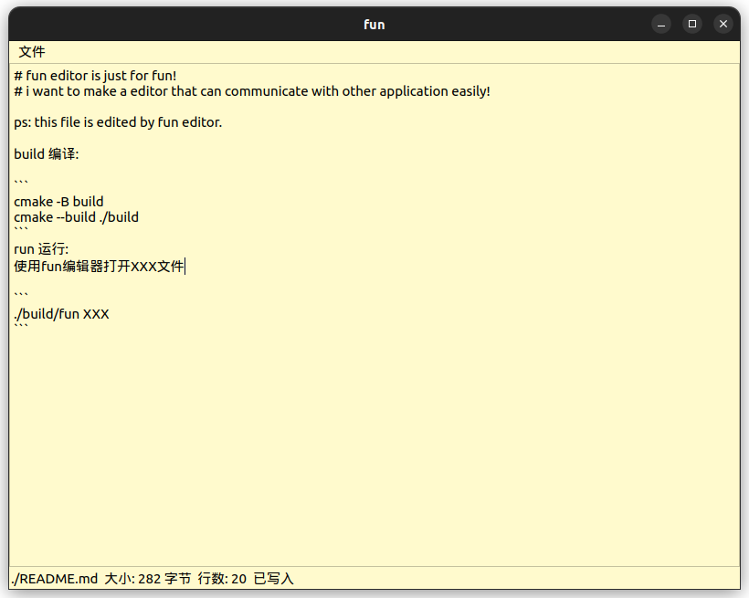

# fun editor is just for fun!
### i want to make a really simple editor that can communicate with other application easily!

ps: this file is edited by fun editor.

build 编译:

```
cmake -B build
cmake --build ./build
```
run 运行:
使用fun编辑器打开XXX文件

```
./build/fun XXX
```
运行截图



